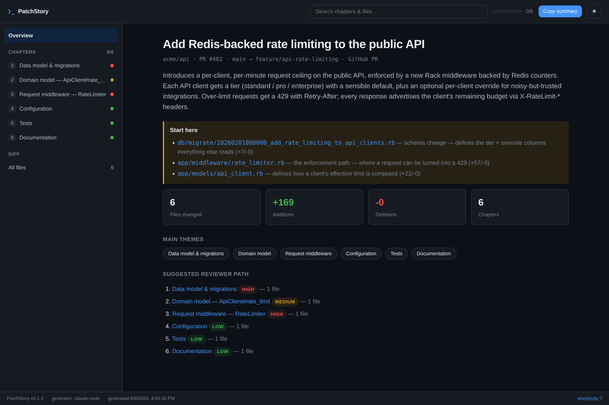
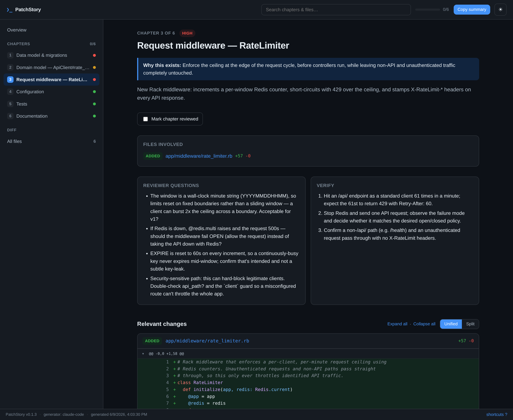

<p align="center">
  
</p>

# PatchStory

[](https://github.com/russ/patchstory/actions/workflows/ci.yml)
[](https://www.npmjs.com/package/patchstory)
[](LICENSE)

Generate a **static, interactive PR walkthrough** from a GitHub pull request,
git branch comparison, commit range, or raw diff — as a self-contained folder of
HTML/CSS/JS you can zip, email, attach to a ticket, or open locally in a browser
with no server.

Instead of dumping a flat file list, PatchStory tells the change as a **story**:
logical chapters, each with intent, the relevant diff hunks, reviewer questions,
risk level, and verification steps.

```bash
patchstory diff main...my-branch --out ./walkthrough
patchstory diff main...my-branch --zip
patchstory commits abc123..def456
patchstory file ./my-pr.diff
patchstory github https://github.com/org/repo/pull/123 -g anthropic
patchstory render ./pr-walkthrough.json --out ./site
```

- **Local-first.** No hosted service, no database, no auth.
- **Zero runtime dependencies.** Custom diff parser, custom ZIP writer, built-in
  `fetch` for the optional AI adapter. Build-time deps only: `esbuild`,
  `typescript`, and `highlight.js` (bundled into `app.js`, so the CLI itself
  ships no `node_modules`).
- **Portable output.** Opens over `file://` (data embedded in `data.js`, no
  `fetch` required). Zip-friendly.
- **AI optional.** A heuristic generator always works with no API key. AI
  *improves* the story; it is never required.

---

## What it looks like

A 6-file PR — *"Add Redis-backed rate limiting to the public API"* — walked
through by PatchStory. The source diff and the agent-authored story are tracked
in [`examples/rate-limiting.diff`](examples/rate-limiting.diff) and
[`examples/rate-limiting.json`](examples/rate-limiting.json); render the page
below yourself with:

```bash
patchstory render examples/rate-limiting.json --diff examples/rate-limiting.diff --single-file --open
```

The **overview** maps the whole change: a "start here" reading list, the stats,
the recurring themes, and a risk-rated reviewer path.

<p align="center">
  
</p>

Open a **chapter** and you get its intent, the reviewer questions to ask, the
verification steps, and the syntax-highlighted diff (unified or split,
collapsible, with per-file "mark reviewed" state).

<p align="center">
  
</p>

---

## Quick start

```bash
git clone https://github.com/russ/patchstory.git
cd patchstory
npm install        # installs deps and builds (via the `prepare` script)

# try it on the bundled example (no git repo needed)
node packages/cli/dist/patchstory.mjs file ./examples/sample.diff --single-file --open
```

`npm install` runs the build automatically. To rebuild after changes, run
`npm run build`. You can `npm link` the `patchstory` package (or run
`node packages/cli/dist/patchstory.mjs`) to get the `patchstory` command on PATH.

**Requirements:** the built CLI runs on **Node ≥ 20**. Local development (the
`npm test` runner, which executes TypeScript directly) needs **Node ≥ 22.6**.

---

## Architecture

The guiding principle: **the AI-generated story is separate from the renderer.**
The renderer consumes a JSON document + a parsed diff and does not care whether
the story came from a heuristic, OpenAI, Claude, a local model, or a human.

```
┌─────────────┐   raw diff   ┌──────────────┐  WalkthroughDocument  ┌──────────────┐
│  sources    │ ───────────▶ │  generator   │ ────────────────────▶ │  renderer    │
│ git / gh /  │              │ none |       │  + ParsedDiff         │ static site  │
│ file / PR   │              │ anthropic    │                       │ (vanilla TS) │
└─────────────┘              └──────────────┘                       └──────────────┘
        \__________________________  pr-walkthrough.json  ___________________________/
                              (canonical intermediate representation)
```

### Packages (npm workspaces)

```
patchstory/
├── package.json              # workspace root; `build` + `typecheck` scripts
├── build.mjs                 # esbuild: bundle web UI, inline assets, bundle CLI
├── tsconfig*.json
├── examples/
│   └── sample.diff           # a multi-area diff for trying the tool
└── packages/
    ├── core/                 # @patchstory/core — input + IR layer (zero deps)
    │   └── src/
    │       ├── types.ts          # WalkthroughDocument, ParsedDiff, …
    │       ├── diff.ts           # unified-diff parser
    │       ├── git.ts            # shells out to `git`
    │       ├── sources.ts        # resolve diff/commits/file/github → raw diff
    │       ├── schema.ts         # JSON Schema + runtime validator
    │       └── generators/
    │           ├── types.ts      # WalkthroughGenerator interface
    │           ├── none.ts       # heuristic generator (no AI)
    │           ├── anthropic.ts  # optional Claude adapter (raw fetch)
    │           └── index.ts      # getGenerator(name)
    ├── renderer/             # @patchstory/renderer — IR → static site
    │   ├── web/                  # the client UI source (vanilla TS + CSS)
    │   │   ├── app.ts
    │   │   ├── styles.css
    │   │   └── index.html
    │   └── src/
    │       ├── index.ts          # renderWalkthrough(bundle, outDir)
    │       └── assets.generated.ts  # built: inlined app.js/css/html
    └── cli/                  # patchstory — the CLI entry point
        └── src/
            ├── cli.ts            # command dispatch
            ├── args.ts           # tiny argv parser
            └── zip.ts            # pure-Node ZIP writer
```

### Why vanilla TS for the UI (not React)

The output must open over `file://` with no server and be trivially zippable.
`fetch()` is blocked on `file://`, so the walkthrough data is embedded as
`window.__PATCHSTORY__` in `data.js`. A single small bundled `app.js` (no
framework runtime) keeps the output lean and robust.

### Generated output layout

```
walkthrough/
├── index.html              # page shell
├── data.js                 # window.__PATCHSTORY__ = { walkthrough, diff, docId }
├── assets/
│   ├── app.js              # bundled UI
│   └── styles.css
└── pr-walkthrough.json     # canonical IR (also for other tools / AI agents)
```

---

## CLI design

```
patchstory <command> [args] [options]

Commands
  diff <range>            git range, e.g. main...feature
  commits <range>         commit range, e.g. abc123..def456
  file <path.diff>        raw unified diff file
  github <pr-url>         GitHub PR (uses `gh` if available, else public .diff)
  render <walkthrough>    render an existing pr-walkthrough.json
  serve [dir|file]        serve an output folder/file on your LAN
  schema                  print the pr-walkthrough.json JSON Schema

Options
  -o, --out <path>        output dir; .html file with --single-file;
                          .json file (or stdout) with --scaffold (default ./walkthrough)
  -g, --generator <name>  none | anthropic (default none)
      --repo <dir>        git repo to operate in (default cwd)
      --model <id>        model id for the anthropic generator
      --scaffold          emit the editable pr-walkthrough.json (the IR) instead
                          of rendering — for an agent or human to enrich
      --emit-diff <file>  with --scaffold: also write the resolved raw diff, so the
                          same bytes can be passed to `render --diff`
      --single-file       emit one self-contained .html (easy to email/attach)
      --redact            mask secrets in the diff before generating/rendering
      --serve             serve the result on your LAN after generating
      --open              open the result in a browser
      --port <n>          port for --serve / serve (default 8137)
      --diff <file>       (render only) raw diff to fill the diff explorer
      --zip               also write <out>.zip
  -h, --help              show help
      --version           show version
```

The `none` generator never needs network or keys. With `-g anthropic` and
`ANTHROPIC_API_KEY` set, PatchStory asks Claude to author the chapters; **on any
error it falls back to the heuristic walkthrough**, so the command always
produces output.

**Handing it off.** Two smooth paths: `--single-file` produces one portable
`.html` you can email or attach to a ticket (everything inlined, opens over
`file://`); or `--serve`/`serve` hosts the output on your LAN and prints a URL
others can open. `--redact` masks secrets (token shapes, `KEY=value`, private
keys) in the diff before it's embedded *or* sent to an AI generator.

### Interactive UI

Syntax-highlighted diffs (highlight.js, bundled at build time — lazily applied
as you scroll so big PRs stay fast), unified/split views, collapsible hunks with
**Expand all / Collapse all**, sidebar chapter nav (slide-in drawer on mobile),
search, file filters, per-reviewer "mark reviewed" state in localStorage, light/
dark, copy-summary, a "Start here" guide and recurring-theme detection on the
overview, related commits per chapter, and a footer build stamp.

Keyboard: `j`/`k` next/prev chapter · `/` search · `e`/`c` expand/collapse all ·
`r` toggle reviewed · `t` theme · `?` shortcuts · `Esc` close.

---

## Author the story with your own AI agent

PatchStory keeps the **story** (a JSON document) separate from the **renderer**, so you
don't need the built-in `anthropic` adapter to get an AI-written walkthrough — you can let
*your own* coding agent (Claude Code, Cursor, aider, …) author it. The agent reads the diff
in the context of the whole repo, so its narrative is usually better than a one-shot API
call, and **no API key is involved**.

The flow is three commands:

```bash
# 1. Scaffold a schema-valid skeleton from any source, plus the exact diff bytes.
patchstory github <pr-url> --scaffold -o pr-walkthrough.json --emit-diff pr.diff

# 2. Your agent rewrites pr-walkthrough.json into a real narrative — chapter intent,
#    risk, reviewer questions, verification steps. Validate against the schema anytime:
patchstory schema > pr-walkthrough.schema.json

# 3. Render the agent's story. --redact keeps secrets out of the embedded diff.
patchstory render pr-walkthrough.json --diff pr.diff --redact --single-file -o pr.html --open
```

`--scaffold` works with every source command (`diff`, `commits`, `file`, `github`) and runs
the `none` heuristic to hand the agent an accurate starting point — correct `stats`, file
groupings, and `diff_hunks` line numbers — which the agent then enriches. Because
`--emit-diff` writes the *same* bytes the scaffold was computed from, the hunk line refs stay
aligned when you `render --diff` them. (`--redact` masks the embedded diff at render time; the
scaffolded IR and emitted diff are left unredacted for the agent to read.)

A ready-to-install **Claude Code** plugin that runs exactly this flow lives in
[`integrations/claude-code/`](integrations/claude-code/):

```text
/plugin marketplace add russ/patchstory
/plugin install patchstory@russ-patchstory
```

It auto-detects the source, scaffolds, has Claude author the narrative, and renders. Other
agents can follow the same three commands.

---

## The walkthrough JSON (`pr-walkthrough.json`)

This is the canonical intermediate representation. The renderer consumes it; AI
agents (or humans) can generate or edit it directly, then run
`patchstory render`. The machine-readable JSON Schema lives in
[`packages/core/src/schema.ts`](packages/core/src/schema.ts) and is validated at
load time. Shape:

```jsonc
{
  "version": "0.1",
  "title": "Add multi-face media review workflow",
  "summary": "Introduces a review workflow for media with multiple detected faces.",
  "source": {
    "type": "github_pr",          // github_pr | git_diff | commit_range | diff_file
    "repo": "org/repo",
    "pr_number": 123,
    "base": "main",
    "head": "feature/multi-face-review"
  },
  "stats": { "files_changed": 12, "additions": 340, "deletions": 72 },
  "themes": ["Data model & migrations", "Detection service", "Tests"],
  "reviewer_path": ["face-detection", "review-state", "tests"],
  "chapters": [
    {
      "id": "face-detection",
      "title": "Detect multiple faces in uploaded media",
      "summary": "Adds metadata and detection logic for multi-face media.",
      "intent": "Determine whether creator approval is needed before publishing.",
      "risk_level": "medium",                  // low | medium | high
      "files": ["app/models/media.rb", "app/services/face_detection_service.rb"],
      "diff_hunks": [
        { "file": "app/models/media.rb", "start_line": 42, "end_line": 88,
          "summary": "Adds face count and review state fields." }
      ],
      "review_notes": [
        "Confirm single-face uploads are not accidentally blocked.",
        "Check what happens when face detection fails."
      ],
      "verification_steps": [
        "Upload media with one face.",
        "Upload media with multiple faces.",
        "Upload media where detection returns no result."
      ]
    }
  ]
}
```

Required: `version`, `title`, `summary`, `source` (+ `source.type`), `stats`,
`chapters` (each needs `id`, `title`, `summary`, `risk_level`, `files`).
Everything else is optional. `start_line`/`end_line` are line numbers in the
**new** file.

---

## How the non-AI (`none`) generator builds a story

It groups changed files into thematic chapters and orders them into a sensible
reading path:

1. **Data model & migrations** (schema/migration files) — read first.
2. **Source modules**, split by their leading directory (e.g. `app/models`,
   `app/services`).
3. **Styling**, then **Tests**, then **Build & configuration**, then **Docs**.

Each chapter gets a heuristic `risk_level` (sensitive paths like auth/payment/
migrations, large changes, or whole-file deletions raise it), plus review
questions and verification steps tailored to the file type. It's genuinely
useful with no API key — AI just makes the narrative better.

---

## Extending with new generators

Implement the one seam:

```ts
interface WalkthroughGenerator {
  readonly name: string;
  generate(input: DiffAnalysisInput): Promise<WalkthroughDocument>;
}
```

Register it in `packages/core/src/generators/index.ts`. The renderer needs no
changes. `openai` and `local` (Ollama) are stubbed to fall back to `none`.

---

## Deferred (intentionally not in this MVP)

- Hosted SaaS, user accounts, database, real-time collaboration, plugin
  marketplace, GitHub App auth — explicitly out of scope.
- **`openai` / `local` generators** — interface is in place; implementations are
  stubs that fall back to `none`.
- **Private GitHub PRs without `gh`** — the public `.diff` fallback only covers
  public repos; authenticated fetch relies on the `gh` CLI.
- **Inline per-line review comments / threads** — only chapter-level notes today.
- **Word-level intra-line diff highlighting** — diffs are line-level (token-level
  syntax highlighting is done; the *intra-line changed-region* highlight is not).
- **Per-commit file mapping for GitHub PRs** — commit→chapter links work for
  local `diff`/`commits`; `github` shows the commit list but can't map files to
  commits without extra API calls.
- **Rename/binary content rendering** — detected and labeled, not deep-diffed.
- **Very large diffs** — everything embeds; highlighting is lazy but there's no
  pagination/virtualization of the DOM yet.
- **`render` without a diff** — synthesizes empty file entries so links resolve;
  pass `--diff <raw.diff>` to populate the diff explorer.

## Testing

```bash
npm test        # node --test over tests/*.ts — diff parser, none generator,
                # schema validation, redaction, zip writer
```

Licensed MIT (see `LICENSE`).

---

## Development

```bash
npm run build       # bundle everything
npm run typecheck   # tsc --noEmit across all packages
```

`build.mjs` bundles `packages/renderer/web/app.ts` to a browser IIFE, inlines it
(plus CSS/HTML) into `assets.generated.ts`, then bundles the CLI (pulling in core
+ renderer) into a single self-contained `packages/cli/dist/patchstory.mjs`.
